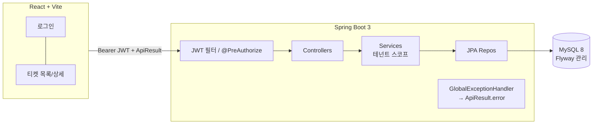

# TicketFlow — 설계 문서

회사·유저·티켓 기반 사내 헬프데스크(티켓) 관리 서비스. RESTful API + React. **표준 응답 규약(ApiResult)·Flyway·JWT·REST Docs** 등 엔지니어링 컨벤션 중심.

## 1. 서비스 개요
회사별로 사용자가 티켓(문의/장애)을 등록하고, 관리자(ADMIN)가 담당자 배정·상태 관리하는 멀티테넌트 헬프데스크.
- **왜 이 주제인가**: 화려한 기능보다 *RESTful 설계·일관된 응답/에러 처리·인가·테스트·문서화* 같은 **실무 컨벤션을 명확히 보여주기에 적합**한 도메인(회사/유저/티켓의 명확한 관계 + 상태 워크플로우 + 멀티테넌트 격리).

## 2. 기술 스택 선택 근거
| 영역 | 선택 | 근거 / 대안 비교 |
|---|---|---|
| 백엔드 | Spring Boot 3 (Java 17) | 요건. Security·Validation·Data JPA 표준 구성 |
| ORM | Spring Data JPA | 엔티티 관계·도메인 행위 중심. 목록은 DTO projection 으로 과조회 회피 |
| 런타임 DB | MySQL 8 (docker-compose) | 운영 동등성. 복합 인덱스·FK 실DB 검증 |
| 테스트 DB | H2 인메모리 | 빠르고 격리. 운영은 Flyway, 테스트는 create-drop+data.sql 역할 분리 |
| 스키마 | **Flyway** | V1 스키마·V2 시드 버전 관리, `ddl-auto=validate` 로 엔티티-스키마 일치 검증 (update 의 운영 위험 회피) |
| 인증 | Spring Security + JWT | 무상태 토큰(클레임에 userId·companyId·role), `@PreAuthorize` 인가 |
| API 문서 | **Spring REST Docs** | 통과한 테스트에서 예시 자동 생성 → 문서-코드 drift 차단 (Swagger 의 코드 오염 회피) |
| 프론트 | React + Vite | 요건. 표준 응답 unwrap 인터셉터로 일관 소비 |
| 빌드 | Gradle | Flyway·asciidoctor 플러그인 + 태스크 배선(test→snippet→asciidoctor) |

> **핵심 컨벤션**: ① `ApiResult<T>` 표준 응답 엔벨로프 + `ErrorCode` 카탈로그 ② package-by-feature + 레이어드(feature 별 controller/service/repository/domain/dto, common 공통) ③ Flyway ④ BaseEntity+Auditing ⑤ `@LoginUser` 로 회사 스코프 주입 ⑥ 네이티브 커스텀 리포지토리(Spring Data 프래그먼트)+DTO 매핑 ⑦ REST Docs.

> **테스트 3계층(총 35)**: 도메인 단위(상태 전이 규칙) · 서비스 단위(Mockito, 테넌트 스코프/가시성/위임) · API 통합(MockMvc + RestDocs). H2 통합 + MySQL E2E 로 네이티브 쿼리까지 양쪽 검증.

## 3. 시스템 구성도

**요청 흐름**: React → (Bearer 토큰) → JwtAuthenticationFilter(클레임→AuthUser) → Controller(@LoginUser AuthUser) → Service(companyId 로 테넌트 격리) → Repo → MySQL. 응답/에러는 모두 `ApiResult` 로 표준화.

## 4. DB 설계
```mermaid
erDiagram
  COMPANIES ||--o{ USERS : "소속"
  COMPANIES ||--o{ TICKETS : "소속"
  USERS ||--o{ TICKETS : "요청(requester)"
  USERS ||--o{ TICKETS : "담당(assignee)"
  TICKETS ||--o{ TICKET_COMMENTS : "코멘트"
  USERS ||--o{ TICKET_COMMENTS : "작성(author)"
  COMPANIES { bigint id PK; varchar name; datetime created_at }
  USERS { bigint id PK; bigint company_id FK; varchar username UK; varchar password_hash; varchar name; enum role; datetime created_at }
  TICKETS { bigint id PK; bigint company_id FK; bigint requester_id FK; bigint assignee_id FK "nullable"; varchar title; varchar description; enum status; enum priority; datetime created_at; datetime updated_at }
  TICKET_COMMENTS { bigint id PK; bigint ticket_id FK; bigint author_id FK; varchar message; datetime created_at }
```
**인덱스 (Flyway V1 단일 소스, 엔티티엔 미명시):**
| 인덱스 | 이유 |
|---|---|
| `users (company_id, role)` | 회사 내 배정 후보(ADMIN) 조회 |
| `tickets (company_id, status, created_at)` | 회사 스코프 목록 + 상태필터 + 최신순 정렬 |
| `tickets (assignee_id)` / `(requester_id)` | 담당자/요청자 필터 |
| `ticket_comments (ticket_id, created_at)` | 코멘트 타임라인 |
| `users.username` UNIQUE | 전역 로그인 ID |

**테넌트 불변식**: 티켓 회사 = 요청자 회사(생성자 파생), 담당자/작성자 = 같은 회사, 모든 조회는 토큰 companyId 로 스코프(미가시 404).

## 5. API 설계
> 모든 응답은 `ApiResult<T>`. 예시는 **REST Docs** 로 테스트에서 자동 생성(`./gradlew asciidoctor` → `build/docs/asciidoc/index.html`).

| Method | Path | 설명 | 인가 |
|---|---|---|---|
| POST | /api/auth/signup | 회사 온보딩(새 회사+ADMIN) | all |
| POST | /api/auth/login | 로그인 | all |
| POST | /api/users | 멤버 추가 | ADMIN |
| GET | /api/users?role= | 사용자 목록(배정 후보) | ADMIN |
| POST | /api/tickets | 티켓 생성 | auth |
| GET | /api/tickets?status=&assigneeId= | 목록(회사 스코프) | auth |
| GET | /api/tickets/{id} | 상세+코멘트 | auth |
| PATCH | /api/tickets/{id}/status | 상태 전이 | auth |
| PATCH | /api/tickets/{id}/assignee | 담당자 배정 | ADMIN |
| POST | /api/tickets/{id}/comments | 코멘트 | auth |
| DELETE | /api/tickets/{id} | 삭제 | ADMIN |
| GET | /api/tickets/stats | 상태별 집계 | auth |

**상태코드**: 200/201/204 · 400(INVALID_INPUT) · 401(UNAUTHORIZED/INVALID_CREDENTIALS) · 403(FORBIDDEN) · 404(NOT_FOUND) · 409(DUPLICATE/INVALID_TRANSITION) · 500(INTERNAL_ERROR).

**예시 — 로그인**
```http
POST /api/auth/login   {"username":"admin1","password":"admin123"}
→ 200 {"success":true,"data":{"token":"eyJ...","user":{"id":1,"username":"admin1","name":"김관리","role":"ADMIN","companyId":1,"companyName":"Acme Corp"}}}
```
**예시 — 잘못된 상태 전이**
```http
PATCH /api/tickets/1/status   {"status":"OPEN"}   (현재 IN_PROGRESS)
→ 409 {"success":false,"error":{"code":"INVALID_TRANSITION","message":"IN_PROGRESS → OPEN 전이는 허용되지 않습니다."}}
```

## 6. AI 도구 활용 내역
**Claude Code(빌더) → Codex CLI(리뷰봇, 커밋마다) → 본인(디렉터)** 파이프라인 + frontend-architect 서브에이전트(프론트 트랙).
- 코드는 AI 작성, 본인은 **스펙 락·설계 결정·리뷰 취사선택**. 전 커밋 전 Codex 리뷰 → 반영/보류 직접 판단.
- **직접 수정/디렉팅 사례**(상세: `ai-review-log.md` 라운드 1~5):
  - 테넌트 격리: assign/생성/코멘트의 사용자 조회를 **회사 스코프(`findByIdAndCompanyId`)**로 교정(ID enumeration 차단), stats 를 list 와 동일 가시성으로
  - 표준화: 예상 밖 예외 `INTERNAL_ERROR(500)` 폴백, 파싱 원문 비노출, `IllegalArgumentException` 무분별 매핑 제거
  - 도메인 불변식: 티켓 회사를 요청자에서 파생, `assignTo` 가드(같은회사 ADMIN·상태), 댓글 N+1 fetch join
  - **AI 리뷰를 그대로 수용하지 않고** 2일 스코프·운영 의미로 반영/보류를 직접 판단(운영급 하드닝은 ⑦)

## 7. 미완성 또는 개선하고 싶은 점
**시간이 더 있었다면**
- 목록/집계 **Pageable** (현재 무제한 — 소규모 데모엔 충분, 스케일 시 필요)
- 토큰 폐기 전략(refresh/jti/tokenVersion), 로그인 rate-limit·계정 잠금 (운영급 보안)
- 알림(이메일/슬랙), 첨부파일, SLA/우선순위 자동화

**현재 한계**
- **네이티브 쿼리 ↔ DB 타입 의존**: 목록/집계를 네이티브(`TicketRepositoryImpl`)로 두면서, H2 는 `created_at` 을 `OffsetDateTime`, MySQL 은 다른 타입으로 반환 → `toInstant()` 로 정규화하고 **H2 통합테스트 + MySQL E2E 양쪽 검증**으로 커버. JPQL projection 대비 타입 안전성↓ 이므로, 더 엄격히 가려면 TestContainers(MySQL) 통합테스트를 상시화하는 게 정석.
- 멀티테넌트 격리는 **앱/도메인 레이어 + 토큰 스코프**로 강제(DB 복합 FK 까진 미적용)
- `signup` 이 즉시 ADMIN 발급(공개 온보딩 가정) — 초대코드/승인은 미구현
- **레이어 커플링(경미)**: `common.security`(AuthUser/JWT)가 `user.domain.Role` 에 의존 — 타입 안전성 우선으로 수용. 엄격 분리 시 권한을 문자열/공통 enum 으로 분리 가능.
