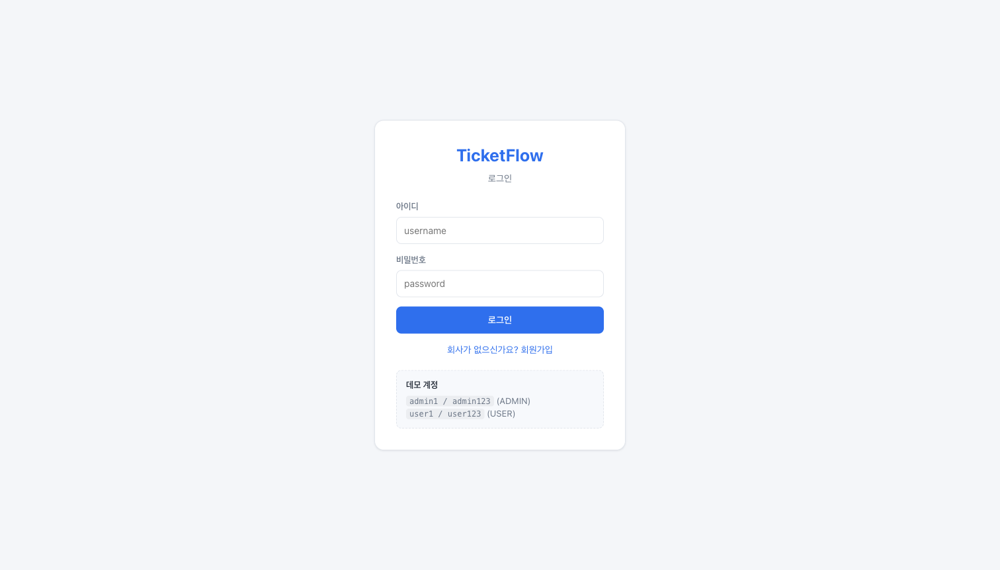
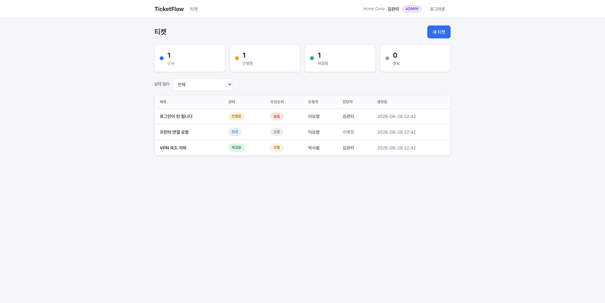
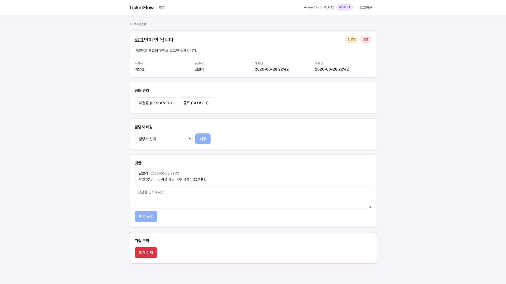

# TicketFlow 사용자 매뉴얼

회사 헬프데스크 티켓 관리 서비스. 아래 화면은 실제 실행 캡쳐(Playwright)입니다.

## 0. 실행 & 접속
```bash
# 한 번에 (Docker)
docker compose up --build   # → http://localhost:5173
```
**데모 계정** (회사: Acme Corp)
| 계정 | 비밀번호 | 역할 |
|---|---|---|
| `admin1` | `admin123` | 관리자(ADMIN) — 배정·삭제·멤버추가·전체조회 |
| `user1` | `user123` | 사용자(USER) — 티켓 등록·본인 티켓 조회 |

---

## 1. 로그인 / 회원가입

- 아이디·비밀번호로 로그인. 데모 계정은 화면 하단 안내 참고.
- **회원가입**(회사가 없으신가요?)을 누르면 *새 회사 + 첫 관리자*를 만들 수 있습니다(회사 온보딩).

## 2. 티켓 목록

- 상단 **상태별 집계**(신규/진행중/해결됨/종료).
- **새 티켓**: 제목·내용·우선순위(높음/보통/낮음) 입력 후 등록.
- **상태 필터**로 좁혀보기. 행 클릭 → 상세.
- 관리자는 **회사 전체** 티켓을, 일반 사용자는 **본인이 요청한** 티켓만 봅니다.

## 3. 티켓 상세 (상태 변경 · 담당자 배정 · 댓글)

- **상태 변경**: 현재 상태에서 *허용된 전이* 버튼만 표시됩니다.
  - 신규 → 진행중 / 종료
  - 진행중 → 해결됨 / 종료
  - 해결됨 → 종료 / 진행중(재오픈)
  - 종료 → (변경 불가)
  - *허용되지 않는 전이를 시도하면 서버가 막고 안내 메시지를 보여줍니다.*
- **담당자 배정**(관리자만): 같은 회사 관리자 중에서 선택해 배정.
- **댓글**: 처리 내역·대화를 시간순으로 기록.
- **티켓 삭제**(관리자만): 위험 구역에서 삭제.

---

## 권한 요약
| 동작 | USER | ADMIN |
|---|---|---|
| 티켓 생성 / 본인 티켓 조회·댓글 | ✅ | ✅ |
| 회사 전체 티켓 조회 | ❌ | ✅ |
| 담당자 배정 / 티켓 삭제 / 멤버 추가 | ❌ | ✅ |

> 다른 회사의 티켓·사용자는 서로 보이지 않습니다(멀티테넌트 격리).
